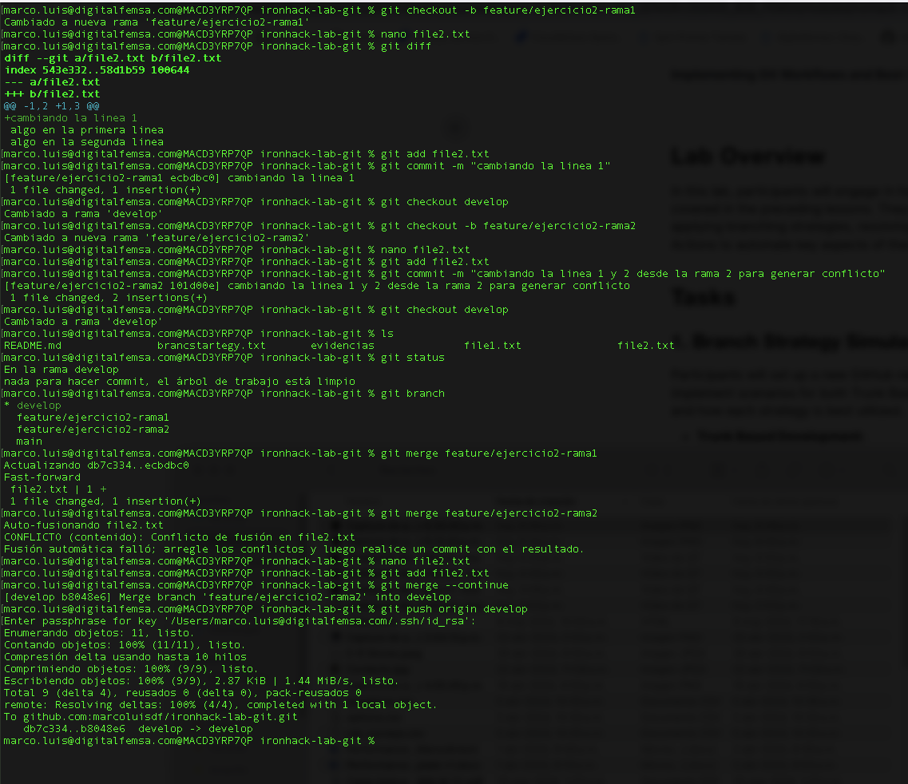
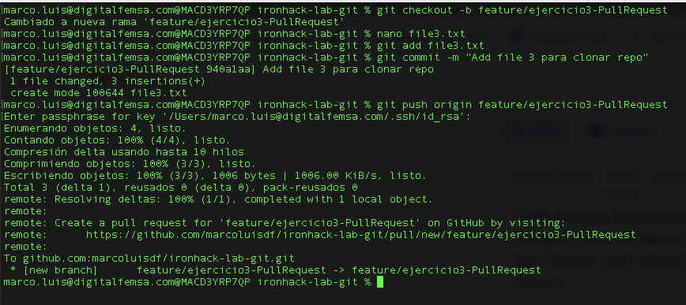
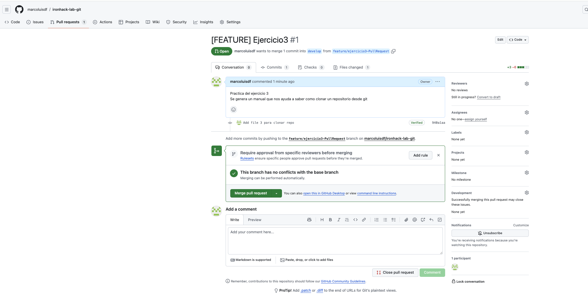

# ironhack-lab-git
Laboratorio Git

## 1. Branch Strategy Simulation

### Trunk base develoment
- clone repositorio
    - git clone git@github.com:marcoluisdf/ironhack-lab-git.git
- crear archivo vacio
    - agregar archivo
    - agregar commit
    - push origin
- Agregar contenido al archivo
    - Agregar cambios
    - Commit cambios
    - Push origin

### Gitflow

- crear rama develop desde main
- crear ramas features desde development
- crear file1 en rama feature feature/req-3245-AddFile1
- crear file2 en rama feature feature/req-3245-AddFile2
- hacer merge en develop de la rama feature/req-3245-AddFile1
- hacer merge en develop de la rama feature/req-3245-AddFile1
- hacer merge en main de la rama develop

### Resolve conflicts

- Crear 2 ramas features desde develop
- En la rama1 modificar la linea 1 del archivo file2.txt
- En la ramna2 modificar la linea 1 y 2 del archivo file2.txt, para generar conflicto en el merge
- Desde develop dar merge a la rama 1
- Desde develop dar merge a la rama 2
- Solucionar conflictos para continuar con el merge

### Pull Request and Code Review Simulation
- Crear rama feature desde develop
- Realizar cambios y pushear la rama feature al origin
- Crear Pull request

